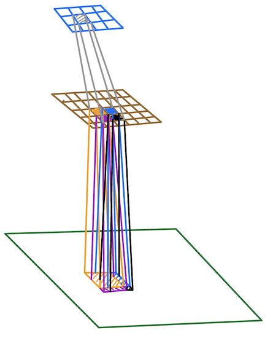
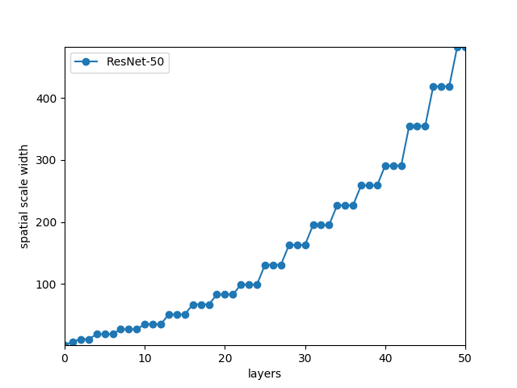
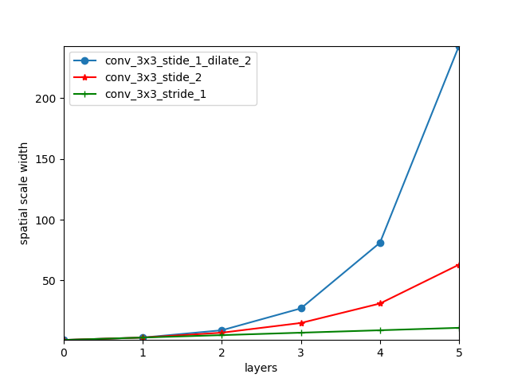

<h3 align="center">

Analysis and Applications of Multi-Scale CNN Feature Maps
</h3>
The goal of this repo and its corresponding blogpost is to provide a deeper insight into the intuitions behind the use cases of multi-scale convolutional
feature maps in the recent proposed CNN architectures for variety of vision tasks. Therefore, this project can be treated as a tutorial to learn more
about how different types of layers impact the spatial scales and receptive fields of feature maps. Also, this repo could be used by those engineers and
researchers that are involved in designing CNN architectures and are tired of blind trial and error of which feature maps to choose from a CNN backbone
to improve the performance of their models, and instead, prefer from the early steps of design process, to match the spatial scale profiles of feature
maps with the object dimensions in training datasets.

 

Diagram of spatial scale formula for 2 x 2 pooling layers. The green rectangle denotes the input image; the brown rectangle denotes the input feature map to the pooling later and the output feature map of the pooling layer is denoted by the blue rectangle. The spatial scale of the orange output entry is the union of the 4 regions marked on the input image which are corresponding to the spatial scales of the 4 neighboring input feature map entries.

### Features
The module that implements the functionalities of computing spatial scales and overlaps for different layers is `spatial.py`. In order to compute the spatial
scale profile for a CNN, first, you need to construct its layer configuration list and then pass it to the `process` method of `spatial.py`. You can use
the `ResNet-50` (the method `resnet_50` in `spatial.py`) as an example to create your own layer configuration. 

